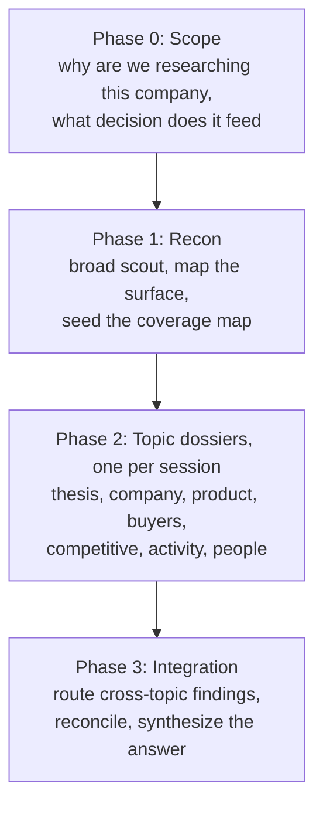

# company-research-pipeline

[](https://opensource.org/licenses/MIT)
[](https://claude.com/claude-code)

> A repeatable pipeline for researching a company to diligence depth, built for [Claude Code](https://claude.com/claude-code) with two research tools: [Exa](https://exa.ai) for neural web search and crawling, and [Apify](https://apify.com) for the sources Exa cannot reach (LinkedIn, X). The output is seven cited, confidence-tagged **dossiers** that together answer every question that matters about a company.

**Status: stable snapshot.** A packaged method, complete as shipped. It distills one real engagement and is not accumulating features; issues and PRs are not actively watched. Fork it and make it yours under the MIT license.

## 💡 Why it exists

Company research fails quietly. The searches work, the prose reads well, and the conclusions are subtly wrong, because a marketing page got treated as shipped product, a stale cache got treated as current, or a single vendor figure got repeated until it looked corroborated. This pipeline packages the guard rails that catch those failures, and every rule in it was earned by hitting the failure it prevents.

It is not a prompt collection. It is the distillation of a real engagement: seven verified dossiers on a venture-backed AI infrastructure company, built from 300+ sources, with every load-bearing claim checked against primary records (regulator filings, package registries, live product documentation, official appointment rosters). The method survived adversarial review. The findings from that engagement stayed private; the method is what ships here.

Every fact in a dossier carries a source. Every judgment is labeled as fact, inference, or assumption, with a confidence percentage. Conflicts between sources are surfaced, never silently resolved.

## 📦 What you bring, what you get back

| You bring | You get back |
|---|---|
| [Claude Code](https://claude.com/claude-code), CLI or desktop | Seven topic dossiers per company (thesis, company, product, buyers, competitive, activity, people), every load-bearing claim cited and tagged |
| The [Exa MCP server](https://docs.exa.ai) connected; it carries the bulk of the research | A living coverage map: what is solid, what needs verification, what is missing |
| The [Apify MCP server](https://docs.apify.com/platform/integrations/mcp) connected (optional; required only for LinkedIn and X coverage) | Adversarial verification reports with per-claim verdicts checked against primary records |
| A company name, and the decision the research feeds | A final synthesis that answers the decision question you started with |

## ⚡ Quickstart

```bash
git clone https://github.com/thangnguyenworkspace/company-research-pipeline.git
cd company-research-pipeline
claude
```

Then, inside Claude Code:

```
/research-company Acme Corp
```

That command scopes the engagement, runs recon, sets up a working folder under `research/acme-corp/`, and walks you through the seven topic dossiers one at a time. Expect one focused session per dossier. You can also run any single piece directly:

| Command | What it does |
|---|---|
| [`/research-company <name>`](.claude/commands/research-company.md) | Orchestrates the whole pipeline for one company |
| [`/research-topic <topic>`](.claude/commands/research-topic.md) | Runs one dossier through gather, verify, attack, write |
| [`/exa-crawl <url>`](.claude/commands/exa-crawl.md) | Crawls one page or PDF with the tuned parameters and fallback |
| [`/social-crawl <urls or handles>`](.claude/commands/social-crawl.md) | Pulls LinkedIn posts or X posts via Apify, behind a budget gate |
| [`/repo-recon <owner/repo>`](.claude/commands/repo-recon.md) | Explores a GitHub repository, scan first then dive |

## 🏗️ The pipeline at a glance



Each topic dossier runs the same eight-step loop: **load context, gather, compile, verify, attack, supplement, write, distribute**. The judgment steps (critical attack, tag assignment, writing) stay with you in the main conversation; the parallelizable legwork (gather, verification fetches) goes to sub-agents. The full method is in [`playbook/01-pipeline.md`](playbook/01-pipeline.md).

## 🧾 What a dossier reads like

An illustrative excerpt (invented company and numbers; the real dossiers this method produced are private):

```markdown
The seed round closed in April 2025 at $6M, led by Meridian Ventures [F/95%]
([funding announcement](https://example.com/press), [Crunchbase](https://example.com/cb)).
The launch burst that followed reads as pre-fundraise positioning [I/70%].

CONFLICT surfaced: the pricing page lists the enterprise tier at $40k/yr
([pricing](https://example.com/pricing)) while a March partner deck says $60k/yr
([deck](https://example.com/deck)); carried, not resolved.
```

The tag grammar: `[F/NN%]` is a fact checked against a primary source, `[I/NN%]` is an inference from evidence, `[A/NN%]` is an assumption that must hold for the read to stand. The percentage is your confidence, assigned by you at write time, never by an agent. The full system, including split tags and the calibration guide, is [`playbook/02-epistemics.md`](playbook/02-epistemics.md).

## ⚖️ The three rules that carry the whole system

1. **No fact without a citation.** Every claim carries an in-text link that resolves to an openable source, and every dossier ends with a reference list. If you cannot trace a claim, it is labeled unverified and treated accordingly.
2. **Tag every judgment.** The tag forces you to know whether you are stating a checked fact, your own inference, or an assumption the whole read depends on.
3. **Verify adversarially.** The verification step tries to refute claims, not confirm them. Marketing pages are evidence of what a company markets; what ships is a separate, harder question. When two sources disagree, both numbers and both sources go in the dossier.

## 🗂️ Repository structure

```
.
├── .claude/commands/    # The five skills, live as slash commands when you open Claude Code here
├── playbook/            # The method: pipeline, epistemics, topics, tools (four docs)
├── research/            # Your working folders land here, one per company
├── templates/           # Skeletons for dossiers, gather reports, verification reports, coverage maps
├── .gitignore           # Excludes OS cruft; add research/{slug}/ here for sensitive engagements
├── AGENTS.md            # Agent entry point; the single source of agent instructions
├── CLAUDE.md            # Imports AGENTS.md (Claude Code); not a separate copy
├── LICENSE              # MIT
├── README.md            # This file, the human entry point
└── repo-manifest.json   # Machine-readable root manifest (identity, maturity, boundaries)
```

## 🧠 Design decisions

| Decision | Why | What it costs |
|---|---|---|
| One topic per session | A dossier written at the tail of a long context window degrades measurably: tags get sloppier, conflicts get resolved instead of surfaced | A full engagement takes eight or more sessions, not one sitting |
| You assign every tag at write time; agents never do | Gather agents report evidence, and evidence is not yet judgment; adjudication is the step that makes the dossier defensible | The write step cannot be delegated |
| Cross-topic routing is a filesystem queue (`pending/` moved to `archive/`) | Append-only files are safe when several sessions write concurrently, and the move doubles as the audit trail | A manual drain discipline at the end of each session |
| Two paid tools plus `curl`, not a broad tool belt | Verified quirks beat breadth: every rule in [`playbook/04-tools.md`](playbook/04-tools.md) was hit in practice, none of it is in the tools' own docs | Where Exa's index is thin, there is no second search engine to fall back on |
| Byte-identical tag legends across all seven dossiers | A reader learns the format once and can triage seven documents by their description fields alone | The format is rigid by design |

## 💸 Cost and limitations

Both tools bill by usage, and the spend is dominated by crawl discipline rather than engagement size. The two Exa cost traps (`maxCharacters` on every crawl, `numResults` explicit and never 0) and the pre-scoring rule are the levers; all three are in [`playbook/04-tools.md`](playbook/04-tools.md). On the Apify side, [`/social-crawl`](.claude/commands/social-crawl.md) presents a budget estimate and waits for a yes before every launch, because the actors' own item caps are the only spend controls that actually work.

Limits worth knowing before you start: where Exa's index is thin there is no second search engine to fall back on; LinkedIn and X are reachable only through Apify's public actors; a full engagement runs eight or more sessions by design; and the output quality tracks how honestly you run the judgment steps, since the pipeline structures the work but does not do the thinking.

## 🔐 What this touches, where your data goes

Search queries and crawl URLs go to Exa, and social targets go to Apify, both under your own API keys through your own MCP servers. Everything retrieved lands on your disk under `research/`. Nothing else leaves the machine: no telemetry, no third-party service, no credentials in the repository (`.gitignore` already excludes `.env*` and `.mcp.json` if you add them). Person-level research is bounded by the public-professional-signal rule in [`playbook/03-topics.md`](playbook/03-topics.md), section 5.

## 🚫 Non-goals

- **Autonomous research.** The judgment steps (critical attack, tag assignment, dossier writing, synthesis) are deliberately human. Agents do legwork only.
- **Continuous monitoring.** This is point-in-time diligence; nothing here watches a company over time.
- **A data product.** The output is markdown dossiers feeding a human decision, not a database or an API.
- **General scraping.** Social coverage goes through Apify's public actors behind an explicit budget gate, nothing else.

## ❓ FAQ

**Can I run it without Apify?** Yes. LinkedIn and X coverage drops out; everything else works. Gather steps that call for a social slice simply skip it.

**Why seven dossiers instead of one report?** A company is too big to research as one question. The decomposition gives every fact exactly one home, which is what makes conflicts findable and keeps any single dossier from bloating into an everything-document. The rationale and build order are in [`playbook/03-topics.md`](playbook/03-topics.md).

**Can I swap in different tools?** The method transfers: the eight-step loop, the tag system, and the verification discipline are tool-agnostic. The tool playbook does not: it is Exa- and Apify-specific on purpose, and swapping tools means rewriting it against your own verified quirks.

**Is this affiliated with Exa or Apify?** No. They are the tools the engagement used; the usage rules are firsthand observations.

## 📄 License

MIT. Use it, fork it, adapt it.
